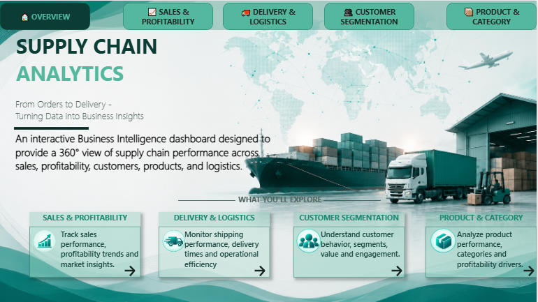

# 🚚 Supply Chain Analytics

### Data Warehouse & Business Intelligence Project

> **From Orders to Delivery — Turning Data into Business Insights**

---

## 📌 Project Overview

**Supply Chain Analytics** is an end-to-end Data Warehouse and Business Intelligence project designed to analyze supply chain performance across sales, profitability, delivery operations, customers, products, and categories.

The project follows a **Medallion Architecture** approach:

**Bronze → Silver → Gold**

The cleaned and transformed Gold layer is connected to **Power BI** to build an interactive analytical dashboard that provides management with a 360° view of supply chain performance.

---

## 🎯 Business Objective

The main objective is to transform raw operational data into meaningful business insights that can support better decision-making.

The dashboard answers key business questions such as:

* Where are sales and profits coming from?
* Which regions and categories generate the highest sales?
* Are orders being delivered on time?
* Which shipping modes and regions have delivery issues?
* Which customer segments generate the most value?
* Which products and categories drive revenue and profitability?
* Where are potential profitability opportunities or operational bottlenecks?

---

## 🏗️ Data Warehouse Architecture

The project uses a layered **Medallion Architecture**:

```text
                 SOURCE DATA
                     │
                     ▼
              ┌─────────────┐
              │   BRONZE    │
              │ Raw Data    │
              └──────┬──────┘
                     │
                     ▼
              ┌─────────────┐
              │   SILVER    │
              │ Cleaned &   │
              │ Validated   │
              └──────┬──────┘
                     │
                     ▼
              ┌─────────────┐
              │    GOLD     │
              │ Business-   │
              │ Ready Data  │
              └──────┬──────┘
                     │
                     ▼
              ┌─────────────┐
              │  POWER BI   │
              │ Analytics & │
              │ Dashboard   │
              └─────────────┘
```

### Bronze Layer

Stores the raw source data with minimal transformation.

### Silver Layer

Focuses on data cleaning, validation, standardization, and preparation for analytical use.

### Gold Layer

Contains business-ready dimensional and fact tables designed for reporting and analytics.

---

## 🗂️ Data Sources

The project works with the following main datasets:

* Customers
* Products
* Orders
* Salesman

These datasets were transformed through the Data Warehouse layers before being consumed by Power BI.

---

## ⭐ Gold Layer

The analytical model includes core business entities such as:

* `Gold.DimCustomers`
* `Gold.DimDate`
* `Gold.DimProducts`
* `Gold.DimSalesman`
* `Gold.FactOrders`

The model follows a dimensional approach where the central fact table is connected to relevant dimension tables.

---

## 📊 Power BI Dashboard

The final dashboard contains **5 pages**, each designed around a specific business question.

### 01 — Overview

A high-level introduction to the Supply Chain Analytics solution.

It provides:

* Project introduction
* Dashboard navigation
* Main analytical areas
* Business scope

---

### 02 — Sales & Profitability

Focuses on financial and sales performance.

Key analysis areas:

* Total Sales
* Total Profit
* Total Orders
* Average Order Value
* Sales Trends
* Sales by Region
* Sales by Category
* Profitability by Region

**Business Question:**

> Where are sales and profitability coming from?

---

### 03 — Delivery & Logistics

Analyzes operational and shipping performance.

Key analysis areas:

* On-Time Delivery
* Average Delivery / Shipping Days
* Late Orders
* Total Shipments
* Delivery Performance Over Time
* Shipping Mode Performance
* Late Deliveries by Region

**Business Question:**

> How efficiently are orders being delivered?

---

### 04 — Customer Segmentation

Focuses on customer behavior and value.

Key analysis areas:

* Total Customers
* Customer Value
* Orders per Customer
* Customer Segments
* Sales by Segment
* Top Customers
* Customer Geographic Distribution

**Business Question:**

> Who are the most valuable customer segments and where are they located?

---

### 05 — Product & Category

Analyzes product performance and profitability.

Key analysis areas:

* Total Products
* Total Sales
* Total Profit
* Profit Margin
* Sales by Category
* Top Products
* Sales by Department
* Product Profitability

**Business Question:**

> Which products and categories are driving revenue and profit?

---

## 📈 Key KPIs

The dashboard includes business-focused KPIs such as:

| KPI                   | Purpose                      |
| --------------------- | ---------------------------- |
| Total Sales           | Measure overall revenue      |
| Total Profit          | Measure generated profit     |
| Total Orders          | Track order volume           |
| Average Order Value   | Measure average order value  |
| On-Time Delivery %    | Monitor delivery performance |
| Late Orders           | Identify delivery issues     |
| Average Shipping Days | Monitor shipping efficiency  |
| Total Customers       | Measure customer base        |
| Orders per Customer   | Analyze customer activity    |
| Total Products        | Measure product portfolio    |
| Profit Margin %       | Evaluate profitability       |

---

## 🎨 Dashboard Design

The dashboard follows a consistent **Emerald Supply Chain Analytics** visual identity.

### Design Principles

* Consistent navigation across all pages
* Emerald / teal visual identity
* Clean analytical layouts
* Fixed background design
* Consistent KPI cards
* Consistent filter panels
* Clear visual hierarchy
* Business-focused chart selection
* Interactive slicers
* Page-to-page navigation

The design was intentionally created to feel like a **single analytical product** rather than five independent Power BI pages.

---

## 🛠️ Tools & Technologies

### Data Warehouse

* SQL Server
* SQL
* Medallion Architecture
* Dimensional Modeling

### Business Intelligence

* Microsoft Power BI
* DAX
* Power Query

### Data Analytics

* Data Cleaning
* Data Validation
* KPI Development
* Business Analysis
* Data Visualization

---

## 🔄 Project Workflow

```text
Raw Source Files
       ↓
Data Profiling
       ↓
Bronze Layer
       ↓
Data Cleaning & Validation
       ↓
Silver Layer
       ↓
Dimensional Modeling
       ↓
Gold Layer
       ↓
Power BI Data Model
       ↓
DAX Measures & KPIs
       ↓
Dashboard Design
       ↓
Business Insights
```

---

## 💡 Business Value

The final solution transforms operational supply chain data into an interactive management analytics tool.

It enables users to:

* Monitor financial performance
* Identify profitable markets and categories
* Detect delivery risks
* Evaluate shipping efficiency
* Understand customer segments
* Identify high-performing products
* Compare regional performance
* Explore trends interactively

---

## 📁 Project Structure

```text
SupplyChainDWH/
│
├── SQL/
│   ├── Bronze/
│   ├── Silver/
│   └── Gold/
│
├── PowerBI/
│   └── SupplyChainAnalytics.pbix
│
├── Data/
│   ├── Customers
│   ├── Products
│   ├── Orders
│   └── Salesman
│
├── Documentation/
│
└── README.md
```

> Update the folder names above if the final GitHub repository uses a different structure.

---

## 📊 Dashboard Overview

### Data Modeling


### Overview



### Sales & Profitability


### Delivery & Logistics


### Customer Segmentation


### Product & Category


---

## 🚀 Key Takeaway

This project demonstrates an end-to-end BI workflow starting from raw operational data and ending with a production-style analytical dashboard.

The main focus was not only on creating visualizations, but on building a structured analytical solution that connects:

**Data Engineering → Data Modeling → DAX → Visualization → Business Insights**

---

## 👨‍💻 Project Focus

**Supply Chain Data Warehouse & Business Intelligence**

Built as a practical project to apply Data Warehousing, SQL, Power BI, DAX, Data Modeling, and Business Analytics concepts in an integrated business scenario.
